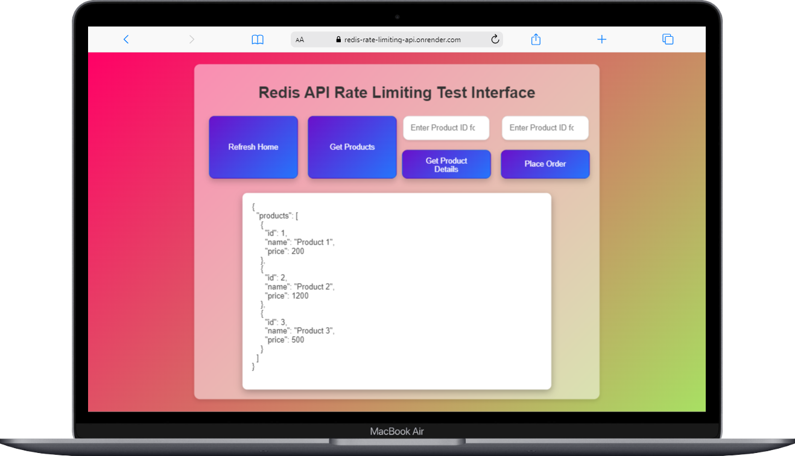
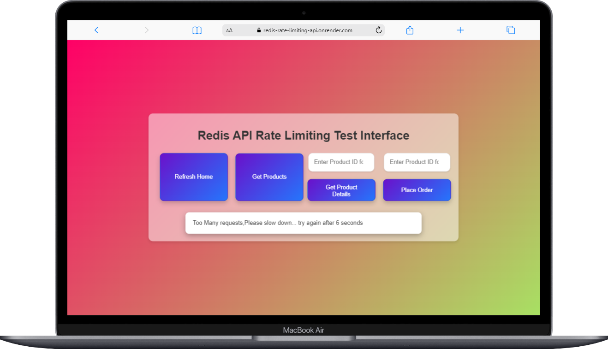
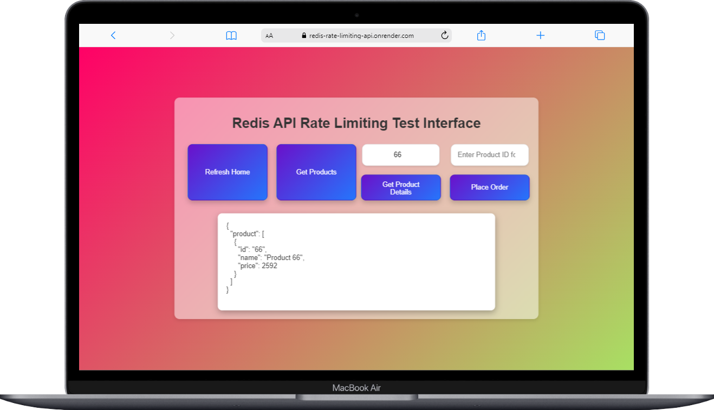
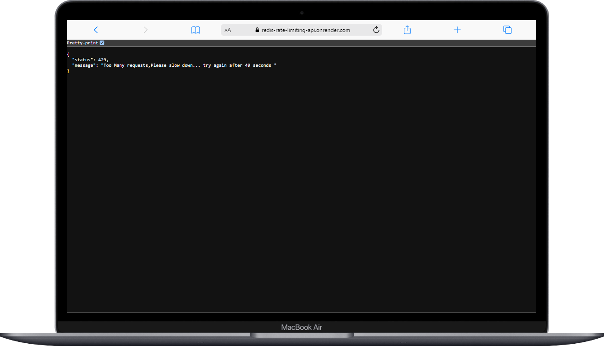
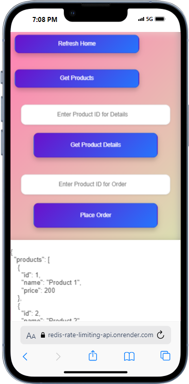
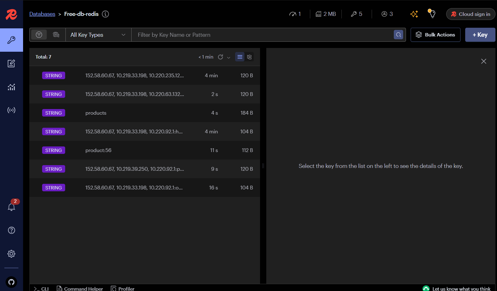
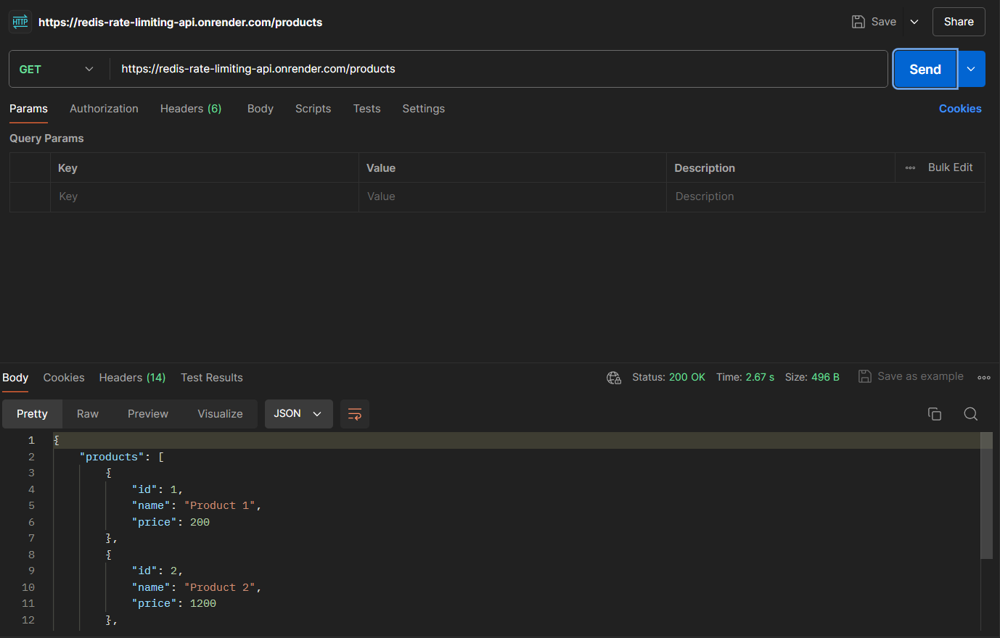
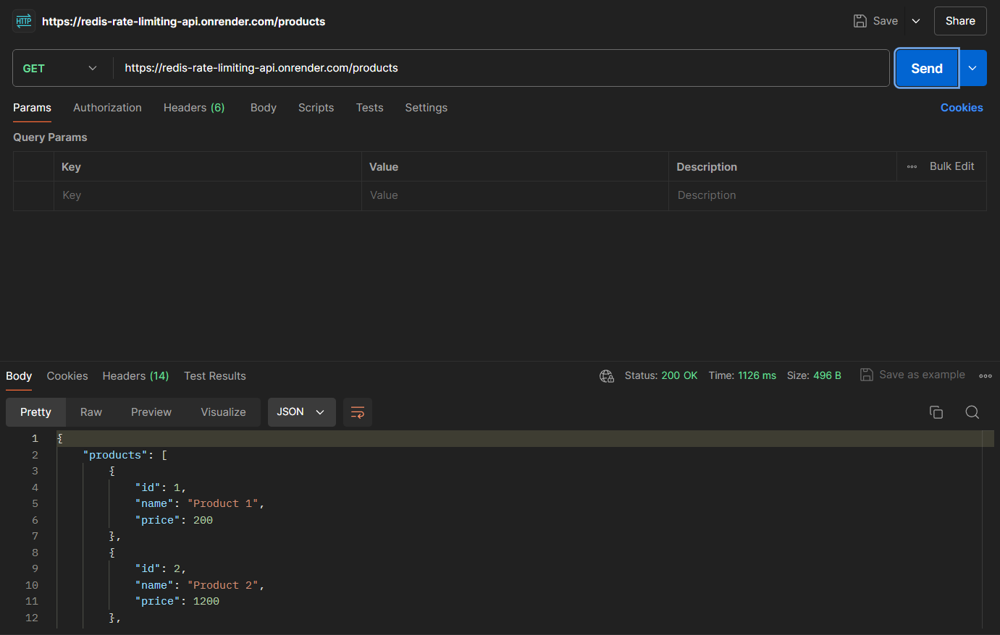

Got it. Since there is no Swagger documentation available for your Redis rate-limiting API, we can revise the documentation to exclude references to Swagger and focus on providing the necessary setup and testing instructions. Here’s the updated version:

---

## Redis Rate Limiting API

### This Project is For Learning Purposes Only

### Live Link: [Live API](https://redis-rate-limiting-api.onrender.com/)


### Tech Stack:
- **Node.js + Express**
- **Redis (Rate Limiting and Caching)**
- **Docker (Containerization)**

### Screenshots:

**API Testing Website:**





**API Mobile Responsive:**


**Redis Dashboard:**


**PostMan Speed Difference because pf caching:**


## Contributing

We welcome contributions to this project! If you would like to contribute, please follow these steps:

### Getting Started

1. **Fork the Repository:**
   - Click on the "Fork" button at the top right corner of this repository's GitHub page.

2. **Clone the Forked Repository:**
   To clone the repository, use the following command:
   ```bash
   git clone https://github.com/VrajVyas11/Redis_Rate_Limiting_API.git
   ```

3. **Navigate to the Project Directory:**
   ```bash
   cd Redis_Rate_Limiting_API
   ```

4. **Install Dependencies:**
   Ensure you have Node.js and npm installed, then run:
   ```bash
   npm install
   ```

5. **Set Up Environment Variables:**
   Create a `.env` file in the root directory and add the necessary environment variables as specified in `.env.example`.

6. **Start the Server:**
   Run the following command to start the server:
   ```bash
   npm start
   ```

7. **Run Tests:**
   To run tests, use:
   ```bash
   npm test
   ```

8. **Build Docker Image:**
   To build the Docker image, use:
   ```bash
   docker build -t redis-rate-limiting-api .
   ```

9. **Run Docker Container:**
   To run the Docker container, use:
   ```bash
   docker run -p 3000:3000 redis-rate-limiting-api
   ```

### API Testing

You can test the API endpoints directly by sending requests to the following URLs:

- **Home Page:** `https://redis-rate-limiting-api.onrender.com/`
- **Get Products:** `https://redis-rate-limiting-api.onrender.com/products`
- **Product Details:** `https://redis-rate-limiting-api.onrender.com/product/:id` (Replace `:id` with the actual product ID)
- **Place Order:** `https://redis-rate-limiting-api.onrender.com/order/:id` (Replace `:id` with the actual product ID)

For more detailed API functionality and parameters, refer to the project’s source code and API documentation within the repository.

For any issues or suggestions, please feel free to open an issue on the GitHub repository.

---

Let me know if there are any other changes you'd like to make!
